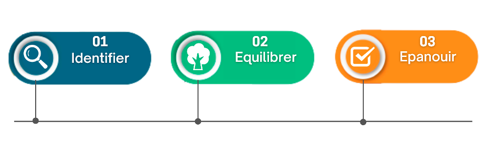

# ✋ Découvrez les bienfaits du Touch for Health®

Le **test** **musculaire** est utilisé comme un moyen d'identifier les déséquilibres énergétiques dans le corps.

Cette approche permet d'équilibrer les circuits musculaires et énergétiques en stimulant les **processus d'autorégulation**.&#x20;

Il en résulte un fort sentiment de BIEN-ÊTRE et de connection avec le flux de la vie.

<figure><figcaption></figcaption></figure>

:thumbsup:  **Les avantages :**

* **Soulage** les tensions et douleurs ; maux de tête, maux de dos, maux d'estomac…
* **Libère** les tensions émotionnelles et mentales,
* **Augmente** l'énergie vitale,
* **Développe** **la** conscience personnelle,
* **Renforce** la santé et le **bien-être**, aide à prévenir les maladies et les blessures.
* **Améliore** les performances ; Défis, Relations, Projets...

Vous seul fixez les limites.


[commencez-ici.md](commencez-ici.md)


**Le** **Touch for Health® Kinesiology** a été créer par le Dr John THIE  grâce au découvertes du Dr GOODHEART Georges sur les traitements naturelles des faiblesses, tensions et spasmes musculaires.

Ce modèle **holistique** **et** **universel** est pratiqué depuis 1973 dans plus de 100 pays.

Il encourage les consultations proactives et opportunes avec des professionnels de santé qualifiés.

Ce n’est en aucun cas, un traitement médical, ni un moyen de diagnostique ou pronosti<mark style="background-color:green;">c</mark>, mais contribue plutôt à un mode de vie sain**,** harmonisé avec des objectifs adaptés au client.

Cela offre un **moyen efficace** pour maintenir sa SANTÉ, améliorer son BIEN-ÊTRE et ses PERFORMANCES.

Une personne peut bénéficier de médicaments, de chirurgie, de vitamines, de minéraux, de conseils psychologiques...etc, en plus de l'équilibrage **Touch for Health®**.

Pour une maladie grave ou des symptômes persistants qui s'aggravent, faites toujours appel aux services d'un professionnel de santé.

<figure><figcaption></figcaption></figure>

:point\_right:  Si vous en ressentez trop de stress,

:point\_right:  avez un besoin de récupérer rapidement,

:point\_right:  vous voulez profitez de votre corps sans douleur,

:point\_right:  et plus que cela… alors cette offre est faîte **pour vous** !

> <mark style="background-color:green;">Réservez ICI</mark>

Touch for health ; Santé par le touché

Offre réservée uniquement aux abonnés et membres Synaptika.

